# VeResc Entity Relationship Diagram

This ERD distinguishes the Firestore documents currently used by the app from
the booking and rating entities that are currently held in in-memory mock
services.

```mermaid
erDiagram
    USERS {
        string uid PK
        string email
        string displayName
        string role
        timestamp createdAt
    }

    PROVIDERS_LEGACY {
        string uid PK, FK
        string role
        string businessName
        string phone
        string address
        number latitude
        number longitude
        number rating
        boolean verified
        string status
    }

    OWNER_VERIFICATION_PROFILE {
        string uid PK, FK
        string role
        string personal_fullName
        string personal_phone
        string personal_address
        string personal_cityMunicipality
        string identification_idType
        string identification_idNumber
        string identification_validIdUrl
        string identification_profilePhotoUrl
        string vehicleDocuments_orCrUrl
        string verificationStatus
        timestamp submittedAt
        timestamp updatedAt
    }

    ONSITE_MECHANIC_PROVIDER_PROFILE {
        string uid PK, FK
        string role
        string personal_fullName
        string personal_phone
        string personal_dateOfBirth
        string personal_address
        string personal_cityMunicipality
        number professional_yearsOfExperience
        stringArray professional_specializations
        stringArray professional_vehicleTypesServed
        string professional_serviceArea
        number professional_maxTravelDistanceKm
        string identification_idType
        string identification_idNumber
        string identification_validIdUrl
        string identification_profilePhotoUrl
        string credentials_certificateUrl
        number serviceInfo_serviceRate
        boolean serviceInfo_emergencyServiceAvailable
        stringArray serviceInfo_availableDays
        string serviceInfo_availableHours
        string verificationStatus
    }

    TOWING_COMPANY_PROFILE {
        string uid PK, FK
        string role
        string company_companyName
        string company_phone
        string company_address
        string company_cityMunicipality
        string company_operatingHours
        stringArray services_towingServices
        stringArray services_vehicleTypesSupported
        string services_serviceArea
        boolean services_emergencyServiceAvailable
        string representative_fullName
        string representative_validIdUrl
        string representative_profilePhotoUrl
        string businessDocuments_permitOrRegistrationUrl
        string verificationStatus
    }

    SHOP_OWNER_HOME_GARAGE_PROFILE_PLANNED {
        string uid PK, FK
        string role
        string shopName
        string ownerName
        string phone
        string address
        string cityMunicipality
        number latitude
        number longitude
        string operatingHours
        stringArray servicesOffered
        stringArray vehicleTypesSupported
        string validIdUrl
        string businessPermitUrl
        string shopPhotoUrl
        string verificationStatus
    }

    VEHICLES_PLANNED {
        string id PK
        string ownerId FK
        string make
        string model
        number year
        string plate
        string vin
        string color
        number mileage
        string fuelType
        string vehicleType
        boolean isPrimary
        date registrationExpiry
        date lastServiceDate
    }

    SERVICE_HISTORY_PLANNED {
        string id PK
        string vehicleId FK
        string ownerId FK
        string bookingId FK
        string providerId FK
        date serviceDate
        string serviceType
        number mileage
        number cost
        string providerName
        string notes
        timestamp createdAt
    }

    MECHANIC_BOOKINGS_PLANNED {
        string id PK
        string ownerId FK
        string providerId FK
        string vehicleId FK
        string problem
        string notes
        string startingPrice
        string status
        timestamp createdAt
    }

    TOWING_BOOKINGS_PLANNED {
        string id PK
        string ownerId FK
        string providerId FK
        string vehicleId FK
        string pickupLocation
        string destination
        string towingType
        string vehicleCondition
        string notes
        string startingPrice
        string status
        timestamp createdAt
    }

    SHOP_BOOKINGS_PLANNED {
        string id PK
        string ownerId FK
        string shopId FK
        string vehicleId FK
        string serviceRequested
        string appointmentAt
        string notes
        string startingPrice
        string status
        timestamp createdAt
    }

    RATINGS_PLANNED {
        string bookingId PK, FK
        string bookingType
        number rating
        string comment
        timestamp ratedAt
    }

    NOTIFICATIONS_PLANNED {
        string id PK
        string recipientId FK
        string title
        string body
        string type
        string relatedBookingId FK
        boolean isRead
        timestamp createdAt
    }

    USERS ||--o| PROVIDERS_LEGACY : "has legacy provider record"
    USERS ||--o| OWNER_VERIFICATION_PROFILE : "has owner verification"
    USERS ||--o| ONSITE_MECHANIC_PROVIDER_PROFILE : "has mechanic verification"
    USERS ||--o| TOWING_COMPANY_PROFILE : "has towing verification"
    USERS ||--o| SHOP_OWNER_HOME_GARAGE_PROFILE_PLANNED : "has shop verification"
    USERS ||--o{ VEHICLES_PLANNED : "owns"
    USERS ||--o{ SERVICE_HISTORY_PLANNED : "views"
    USERS ||--o{ MECHANIC_BOOKINGS_PLANNED : "creates"
    USERS ||--o{ TOWING_BOOKINGS_PLANNED : "creates"
    USERS ||--o{ SHOP_BOOKINGS_PLANNED : "creates"
    PROVIDERS_LEGACY ||--o{ MECHANIC_BOOKINGS_PLANNED : "receives"
    PROVIDERS_LEGACY ||--o{ TOWING_BOOKINGS_PLANNED : "receives"
    PROVIDERS_LEGACY ||--o{ SHOP_BOOKINGS_PLANNED : "receives"
    VEHICLES_PLANNED ||--o{ MECHANIC_BOOKINGS_PLANNED : "used for"
    VEHICLES_PLANNED ||--o{ TOWING_BOOKINGS_PLANNED : "used for"
    VEHICLES_PLANNED ||--o{ SHOP_BOOKINGS_PLANNED : "used for"
    VEHICLES_PLANNED ||--o{ SERVICE_HISTORY_PLANNED : "has"
    MECHANIC_BOOKINGS_PLANNED ||--o| RATINGS_PLANNED : "has"
    TOWING_BOOKINGS_PLANNED ||--o| RATINGS_PLANNED : "has"
    SHOP_BOOKINGS_PLANNED ||--o| RATINGS_PLANNED : "has"
    MECHANIC_BOOKINGS_PLANNED ||--o| SERVICE_HISTORY_PLANNED : "may create"
    SHOP_BOOKINGS_PLANNED ||--o| SERVICE_HISTORY_PLANNED : "may create"
    USERS ||--o{ NOTIFICATIONS_PLANNED : "receives"
    MECHANIC_BOOKINGS_PLANNED ||--o{ NOTIFICATIONS_PLANNED : "triggers"
    TOWING_BOOKINGS_PLANNED ||--o{ NOTIFICATIONS_PLANNED : "triggers"
    SHOP_BOOKINGS_PLANNED ||--o{ NOTIFICATIONS_PLANNED : "triggers"
```

## Current Firestore paths

| Entity | Firestore path |
| --- | --- |
| User account | `users/{uid}` |
| Owner verification | `users/{uid}/ownerProfile/profile` |
| Onsite mechanic verification | `users/{uid}/providerProfile/profile` |
| Towing company verification | `users/{uid}/towingCompanyProfile/profile` |
| Shop owner / Home Garage verification (planned) | `users/{uid}/shopProfile/profile` |
| Legacy provider profile | `providers/{uid}` |

## Storage and booking notes

- Verification image/document files are stored in Cloudinary. Firestore stores their returned `secure_url` values.
- `providers/{uid}` is retained as a legacy provider profile and must not be migrated or deleted without a separate migration plan.
- Mechanic bookings, towing bookings, and ratings currently use mock in-memory services. The `*_PLANNED` entities show the recommended relationship structure when those services are moved to Firestore.
- The Home Garage / Shop Owner module is represented as planned scope. It reuses the provider verification, Cloudinary document, vehicle, booking, rating, and notification patterns.
- Notifications are currently UI-only; no notification records are stored yet. A future Firestore path can be `users/{uid}/notifications/{notificationId}`.
- No in-app messenger entity is included. Provider contact uses the device's native phone and SMS applications through `tel:` and `sms:` links.
- Vehicles currently come from `data/owner/mockVehicles.ts`. A future Firestore path can be `users/{uid}/vehicles/{vehicleId}`; each booking already holds the matching `vehicleId`.
- Service history currently comes from mock vehicle data. A future Firestore path can be `users/{uid}/vehicles/{vehicleId}/serviceHistory/{recordId}`. A completed mechanic or shop booking can create the corresponding record.
- The current booking types contain `providerId` and `vehicleId`. The recommended future Firestore booking documents should also persist `ownerId` to express ownership and make security rules/querying reliable.
