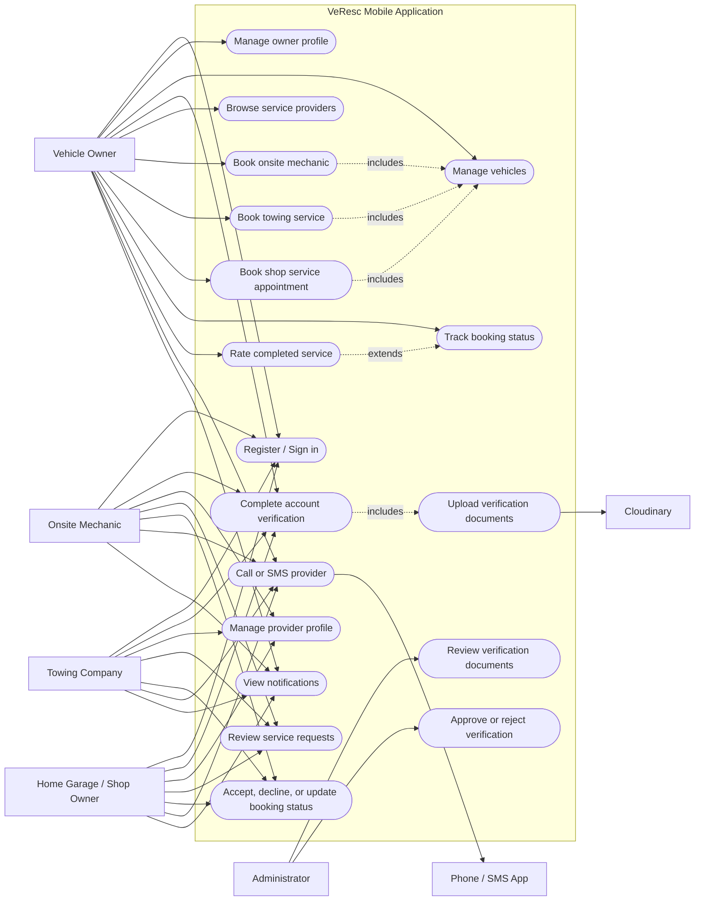

# VeResc Use Case Diagram

## Actors

| Actor | Main responsibilities |
| --- | --- |
| Vehicle Owner | Maintains vehicles, verifies their account, books mechanic/towing/shop services, tracks and rates bookings. |
| Onsite Mechanic | Verifies provider account, reviews mechanic requests, updates service progress, contacts customers. |
| Towing Company | Verifies company account, reviews towing requests, updates towing progress, contacts customers. |
| Home Garage / Shop Owner | Verifies the shop, manages services and appointments, reviews shop bookings, and updates booking status. |
| Administrator | Reviews verification submissions and approves or rejects provider/owner verification. |
| Cloudinary | Stores uploaded verification documents and returns secure URLs. |
| Phone / SMS App | Handles direct calls and SMS; VeResc has no separate in-app messaging feature. |

## Current implementation note

The diagram represents the capstone’s intended workflow. Verification and Cloudinary uploads are implemented. Booking, ratings, and notifications are currently partly backed by mock/in-memory services and can be migrated to Firestore later without changing the use cases.
